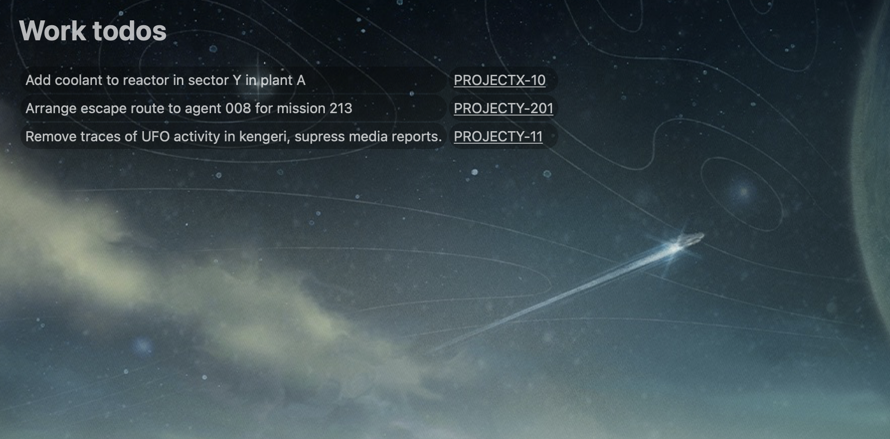

# freshrelease-uebersicht-widget


An [Uebersicht](https://tracesof.net/uebersicht/) widget to display your tasks on screen

* refreshes every hour.
* displays only unresolved issues

## Install

```bash
cd ${HOME}/Downloads/ && \
wget https://github.com/raghu-nandan-bs/freshrelease-uebersicht-widget/archive/refs/heads/main.zip -O freshrelease-uebersicht-widget-main.zip && \
    unzip freshrelease-uebersicht-widget-main.zip && \
    cp -r freshrelease-uebersicht-widget-main ${HOME}/Library/Application\ Support/Übersicht/widgets
```

## Customize

update following variables in `jsx` file
```jsx
const OWNER_ID          = "" // Add your freshrelease user ID
const API_KEY           = "" // Add your freshrelease personal token
const FRESHRELEASE_URL  = "" // Add freshrelease URL for your organization
const TITLE             = "Work todos" // Modify this as you please
```

## Example


